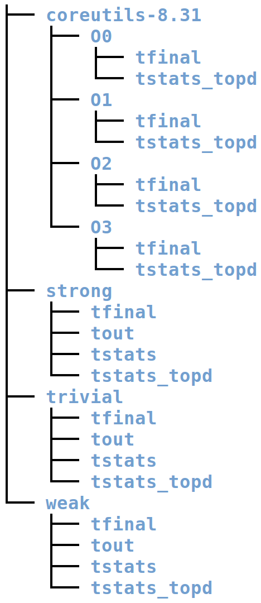

# 
 Opaque Predicates Detective (Evaluations) 

This repo. contains the evaluations I used for the project, Opaque Predicates Detective.

__NOTE__: I paused my BinaryNinja update during development, so this plugin has only been tested on BinaryNinja Version 1.2.1922-dev but I'm sure it will work fine on the newest version. In the upcoming week I will test it on the newest BinaryNinja version.

### coreutils folder
This is what I used for baseline evaluation. It is compiled at optimization levels O0, O1, O2, O3 – hence those folder names.

### trivial/weak/strong folder 
The `trivial` folder contains datasets pertaining to trivial opaque predicates. The content of `weak` and `strong` can be respectively inferred. 

A trivial opaque predicate is constructed within a basic block.

A weak opaque predicate is constructed within a function.

A strong opaque predicate is constructed throughout multiple functions. 

Christian Collberg is the first to classify opaque predicates into trivial/weak/strong in his paper "A taxonomy of obfuscating transformations."

### tfinal/tout/tstats/tstats\_topd folder
Root directory of trivial/weak/strong folder contains the original source code files from `github.com/tum-i22/obfuscation-benchmarks`. Note that source code files inside the `tigress-generated-programs` folder in Banescu's benchmarks are not included since they are randomly generated, thus unrealistic. 

`tfinal` folder contains the corresponding obfuscated binaries. 

`tout` folder contains the corresponding obfuscated source code files.

`tstats` folder contains the virtual addresses of where the superfluous basic blocks are located in the obfuscated binaries.

`tstats_topd` folder contains the virtual addresses of where OpaquePredicatesDetective identifies the start of the superfluous basic blocks in the obfuscated binaries. 

